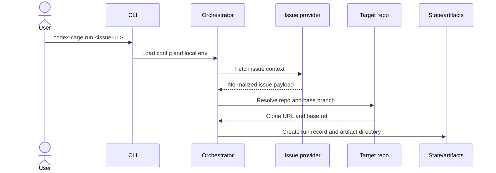
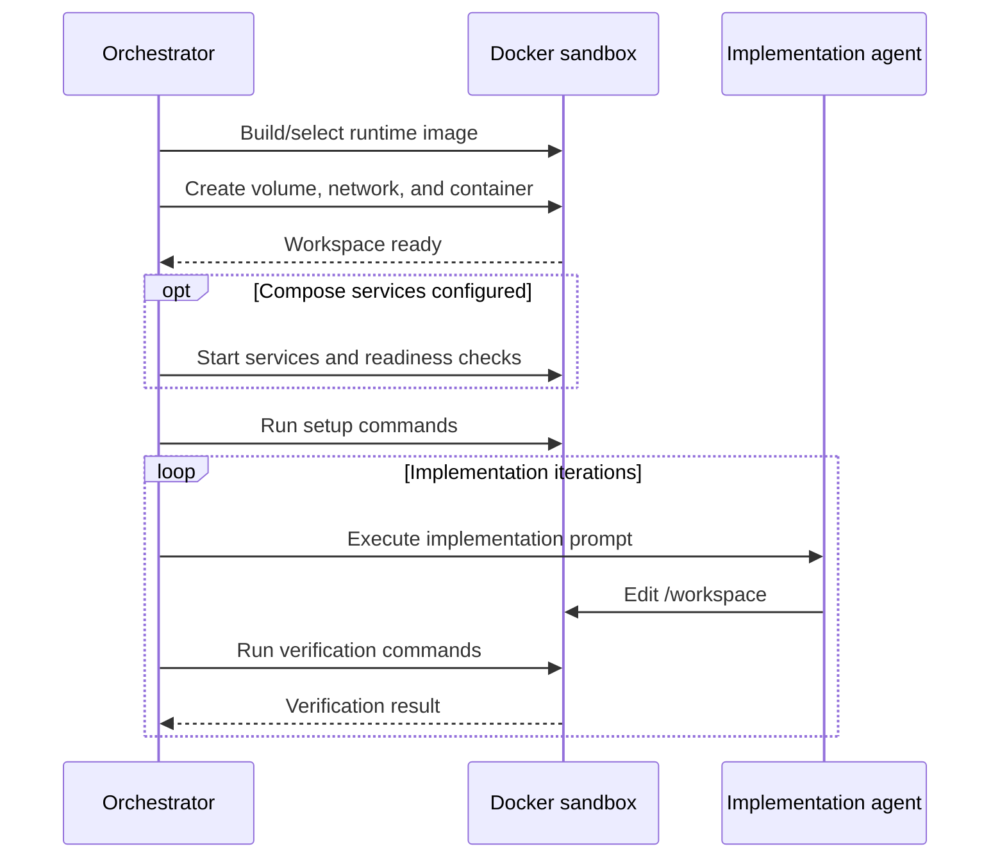
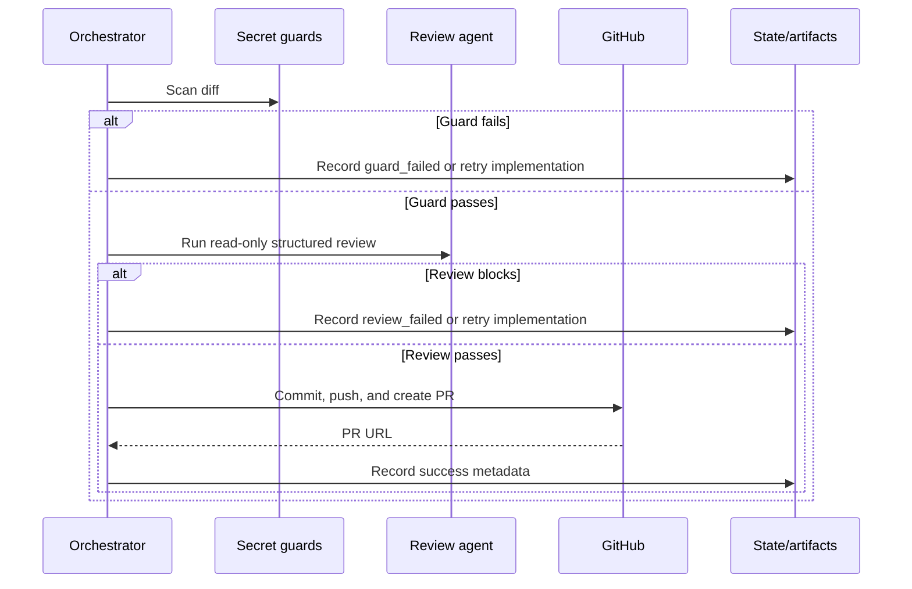

# Codex Cage

Codex Cage is a lightweight CLI for running Codex against issue-driven work in an isolated Docker workspace. The CLI can initialize target repos, run the issue-driven orchestration loop, inspect local run metadata, and clean up managed Docker resources.

Full setup, token, configuration, security, and QA details live in [docs/workflow.md](docs/workflow.md). Read [docs/security.md](docs/security.md) before running Codex Cage on a repository; Codex Cage is not a general sandbox for untrusted code.

## Demo

https://github.com/user-attachments/assets/66e43421-9aa6-4024-8f82-6f0e9d385d6f

## Install

Requirements:

- Node.js `>=22`
- Docker
- Git
- A Codex auth method, either `OPENAI_API_KEY` or host Codex OAuth
- `GITHUB_TOKEN` for GitHub issue lookup, clone, push, and PR creation

From this repository:

```bash
npm install
npm run build
npm install -g .
codex-cage --help
```

For a one-off local invocation without global install:

```bash
npm install
npm run build
npm exec -- codex-cage --help
```

## Run Codex Cage

Run initialization inside the target repository:

```bash
codex-cage init
```

Then edit `.codex-cage.yml` so `setup` installs the target repo dependencies and `verify` runs the real validation command:

```yaml
setup:
  - npm ci

verify:
  - npm test
```

Create `.codex-cage.env` in the target repository with local secrets that must not be committed:

```dotenv
OPENAI_API_KEY=...
GITHUB_TOKEN=...
LINEAR_API_KEY=...
```

Run a GitHub issue:

```bash
codex-cage run https://github.com/OWNER/REPO/issues/123
```

Run a Linear issue by passing the target GitHub repo:

```bash
codex-cage run https://linear.app/ORG/issue/ENG-123/title --repo OWNER/REPO
```

Inspect local run state:

```bash
codex-cage runs list
codex-cage runs show <run-id>
```

## Command Reference

Use `codex-cage --help` or `codex-cage <command> --help` for the current CLI help.

| Command                              | Purpose                                                                                 |
| ------------------------------------ | --------------------------------------------------------------------------------------- |
| `codex-cage init`                    | Create Codex Cage config files in the current repository.                               |
| `codex-cage init --dockerfile`       | Also create `.codex-cage/Dockerfile` for target repos that need custom system packages. |
| `codex-cage run <issue-url>`         | Run the full issue-to-PR workflow for a GitHub or Linear issue.                         |
| `codex-cage run --issue <issue-url>` | Alternate issue URL form kept for compatibility.                                        |
| `codex-cage runs list`               | List locally recorded runs from `.codex-cage/codex-cage.sqlite`.                        |
| `codex-cage runs show <run-id>`      | Show run metadata, phase status, and artifact paths.                                    |
| `codex-cage cleanup`                 | Remove stale stopped Docker resources managed by Codex Cage.                            |
| `codex-cage cleanup --all`           | Remove all managed Docker resources, including active ones.                             |

### Initialize a Target Repo

```bash
codex-cage init
```

This creates:

- `.codex-cage.yml`
- `.codex-cage/review-policy.md`
- `.codex-cage.env.example`
- `.gitignore` entries for local Codex Cage runtime state

Use `--dockerfile` when the target repo needs custom system packages:

```bash
codex-cage init --dockerfile
```

The generated verify command intentionally fails until replaced with the target repo's real test command. Re-running `init` leaves existing config files in place and creates only missing managed files.

Codex Cage relies on Codex CLI's native `AGENTS.md` handling for repository implementation guidance. It does not inject `AGENTS.md`, `.codex-cage/instructions.md`, `.github/copilot-instructions.md`, or `CLAUDE.md` contents into prompts. Independent review can use `.codex-cage/review-policy.md` for stricter project-specific checks; prompt artifacts record only whether that policy file is present and where the reviewer can read it.

### Run an Issue

```bash
codex-cage run https://github.com/OWNER/REPO/issues/123
```

Common options:

- `--repo OWNER/REPO`: override target repo resolution, commonly needed for Linear issues.
- `--base <branch>`: override the base branch from config.
- `--model <model>`: override the Codex model for this run.
- `--draft`: create a draft GitHub PR.

The `run` command reads `.codex-cage.yml` and `.codex-cage.env`, fetches issue context, resolves the target repo, creates a Docker workspace, starts configured Compose services, runs Codex implementation iterations, verifies configured commands, scans the diff for secrets, runs independent review, and publishes a PR when all gates pass.

### Inspect Local Runs

```bash
codex-cage runs list
codex-cage runs show <run-id>
```

Run metadata is stored in `.codex-cage/codex-cage.sqlite`. Large artifacts such as logs, patches, issue payloads, prompt context, and summaries are stored under `.codex-cage/runs/<run-id>` rather than inside SQLite.

## Design Architecture

Codex Cage is organized as a host-side orchestrator around disposable Docker workspaces. The host CLI owns configuration, issue lookup, repository resolution, Docker resource lifecycle, credential scoping, run state, verification, review, and publishing. Implementation and review agents run inside the sandbox with only the credentials and filesystem access required for their phase.

Host preparation:



Sandbox execution:



Gates and publish:



The main runtime flow is:

1. Load `.codex-cage.yml` and `.codex-cage.env`.
2. Fetch issue context from GitHub or Linear.
3. Resolve the target repository and base branch.
4. Create a run record, artifact directory, Docker volume, and Docker network.
5. Build or select the runtime image.
6. Clone the target repo into the Docker workspace.
7. Start configured Compose services and run setup commands.
8. Run Codex implementation iterations.
9. Run configured verification commands.
10. Scan the diff for secret leaks and protected files.
11. Run independent read-only Codex review.
12. Commit, push, and create a GitHub PR only after all gates pass.

Module responsibilities:

- `src/cli.ts` and `src/commands.ts`: command-line parsing, user-facing output, and command dispatch.
- `src/config.ts`: `.codex-cage.yml` schema, defaults, validation, and warnings.
- `src/issue.ts` and `src/repo.ts`: issue-provider normalization and repository resolution.
- `src/run.ts`: top-level orchestration loop and phase transitions.
- `src/docker.ts` and `src/compose.ts`: Docker sandbox, runtime image, command execution, and Compose lifecycle.
- `src/credentials.ts`: credential classification and phase-scoped command options.
- `src/state.ts`: SQLite run metadata plus filesystem artifact paths.
- `src/prompt-context.ts` and `src/review.ts`: prompt artifacts, review policy discovery, structured review execution, and review parsing.
- `src/guards.ts`: diff and secret guard checks before publish.
- `src/publish.ts`: branch, commit, push, and pull request creation.
- `src/init.ts`: target-repo bootstrap files.

Architectural boundaries:

- Keep host orchestration separate from sandbox execution. The target repo is cloned into a Docker volume; the host working tree is not bind-mounted into the agent container.
- Keep credentials phase-scoped. Setup and verify should not receive Codex, OpenAI, or GitHub credentials by default; implementation and review receive only Codex auth; publish receives only GitHub auth.
- Treat issue bodies, comments, target repo files, and command output as untrusted input. Validate structured data at boundaries and redact known secret values before writing logs.
- Keep publishing host-owned. Implementation and review agents must not commit, push, or create PRs.
- Store small run metadata in SQLite and large artifacts as files under `.codex-cage/runs/<run-id>`.

## Issue Context

Codex Cage supports GitHub and Linear issue URLs as normalized task context.

- GitHub issue URLs infer the target repo from the URL.
- Linear issue URLs infer the issue key from the URL, but the target repo must come from a later repo-resolution step.
- GitHub context uses `GITHUB_TOKEN` when provided.
- Linear context requires `LINEAR_API_KEY`.
- Empty comments and known bot comments are filtered out.
- The default issue context includes the last 10 human comments.

## Repository Resolution

Target repositories are resolved in this order:

1. Explicit `--repo`
2. GitHub issue URL inference
3. Current directory `git remote get-url origin`

If a GitHub issue URL points at a different repo than the current directory origin, Codex Cage fails unless `--repo` is passed explicitly. GitHub operations use HTTPS token auth with `GITHUB_TOKEN`; SSH remotes are normalized to `owner/repo` and converted to token-authenticated HTTPS clone URLs internally.

## Docker Sandbox

Codex Cage prepares disposable Docker resources per run:

- A labeled Docker volume for `/workspace`
- A labeled Docker network for run-local connectivity
- An agent container using the pinned default image `ghcr.io/jhowliu/codex-cage/base:0.1.1`

The sandbox runs as the non-root `agent` user, clones the target repo into the volume, and does not bind mount the host working tree, Docker socket, SSH config, GitHub CLI config, or host ports.

The publishable base image is defined in `docker/base` and published to GHCR as `ghcr.io/jhowliu/codex-cage/base:<version>`. The image contains only the orchestration tools needed by Codex Cage: Node.js/npm, pinned Codex CLI, `git`, `gh`, `curl`, `jq`, certificates, OpenSSH client, and the non-root `agent` user. Target repositories should add project-specific runtimes or build tools through their own `.codex-cage/Dockerfile`.

Runtime images are configured in `.codex-cage.yml`. If `runtime.dockerfile` is set, Codex Cage builds a labeled per-run image from that Dockerfile using `.codex-cage/` as the build context before cloning the target repository. If no Dockerfile is configured, Codex Cage uses `runtime.image`.

## Compose Services

Target repos can configure Docker Compose services in `.codex-cage.yml`:

```yaml
setup:
  - npm ci
  - cp .codex-cage/test.env .env
  - npm run migrate --workspace=server

verify:
  - npm run test --workspace=server

services:
  compose: .codex-cage/docker-compose.yml
  ready:
    - pg_isready -h postgres -U postgres
```

Codex Cage uses a per-run Compose project name, starts services with `docker compose up -d`, attaches the agent container to the Compose network, runs readiness checks from an ephemeral container on that network, and tears services down with `docker compose down -v`.

Compose is host-orchestrated by Codex Cage. Do not mount `/var/run/docker.sock` into the agent container or expect the agent to run Docker itself. Agent commands should reach dependencies through Compose service DNS names such as `postgres`, `redis`, or `minio`; avoid publishing host ports unless the target repo has a specific reason.

For target repo test environment files, prefer a committed non-secret fixture such as `.codex-cage/test.env` and copy it to `.env` during `setup`. That keeps generated `.env` files local while making test credentials and service hostnames easy to review. Do not commit real secrets in these fixture files.

## Secret Guards

Local secrets live in `.codex-cage.env`, which is parsed by the orchestrator and passed to Docker as process environment, not mounted into the container or written into command arguments. Known secret values are redacted from logs.

Guard scanning checks diffs for injected secret values, high-confidence token patterns, private key material, and sensitive auth files such as `.env`, `.codex-cage.env`, `.npmrc`, `.ssh/*`, `.config/gh/*`, and `.aws/*`. Sample env files like `.env.example`, `.env.sample`, and `.env.template` are allowed, but their added content is still scanned for secret-looking values.

## Independent Review

After implementation verification passes, Codex Cage runs a fresh Codex review process by default. The reviewer receives issue context, the diff against base, result metadata, and the verification summary, and it must return structured JSON with a `pass` or `blocking` decision.

Review is read-only. If the diff changes during review, the run fails instead of publishing. Blocking findings are formatted as implementation feedback until `agent.max_review_cycles` is exhausted.

## Publishing

Successful runs are published by the orchestrator, not by the implementation or review agents. Codex Cage rejects empty diffs, creates a run-specific branch, configures the Codex Cage git author, commits once, pushes without force, and creates a ready GitHub PR by default.

PR bodies include the summary, verification, review status, risks, run id, and issue linkage. GitHub issues use closing keywords such as `Closes #123`; Linear issues are linked without mutating Linear.

## Cleanup

Use cleanup to remove Docker resources with Codex Cage labels. It never deletes local run artifacts or the SQLite database.

```bash
codex-cage cleanup
codex-cage cleanup --all
```

- `codex-cage cleanup` removes stopped containers plus networks and volumes for runs without active managed containers.
- `codex-cage cleanup --all` also removes active managed containers and their networks and volumes.

## Development

| Command             | Purpose                                     |
| ------------------- | ------------------------------------------- |
| `npm install`       | Install project dependencies.               |
| `npm run typecheck` | Run TypeScript without emitting files.      |
| `npm test`          | Build and run the Node test suite.          |
| `npm run qa`        | Run the focused QA harness.                 |
| `npm run qa:image`  | Build and smoke-test the base Docker image. |
| `npm run format`    | Check repository formatting with Prettier.  |

If the default npm cache has local permission problems, use a temporary cache for package smoke checks:

```bash
npm --cache /tmp/codex-cage-npm-cache exec -- codex-cage --help
npm --cache /tmp/codex-cage-npm-cache pack --dry-run
```

## License

Codex Cage is licensed under the [Apache License 2.0](LICENSE).
